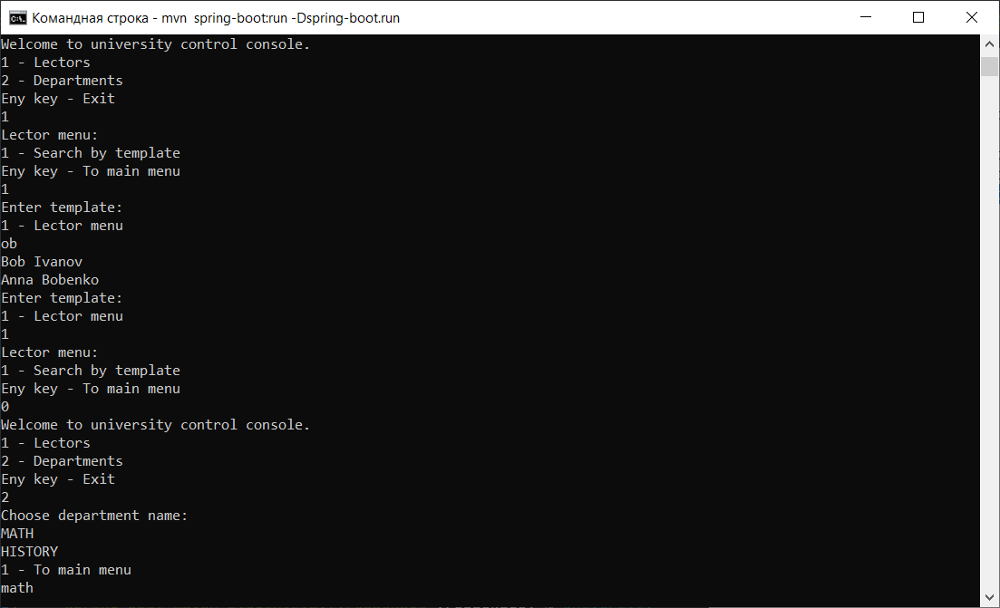
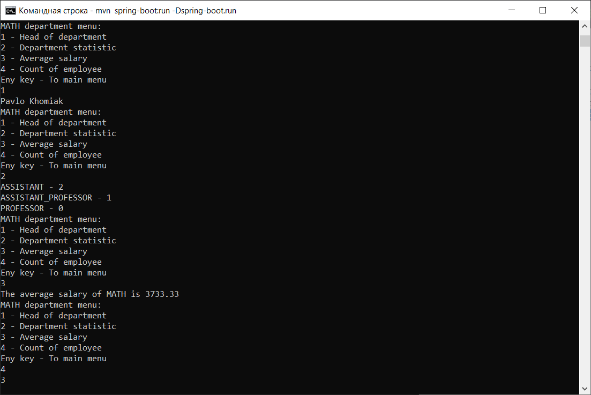

# university
University application
This is university application with console interface. For run application from command line:

1. Install maven and define system variable and path
2. In command line in application package run command:
   mvn spring-boot:run -Dspring-boot.run
3. Enjoy

